# MyLibrary

## アプリケーションの概要

自分が持っている本を電子的に記録する蔵書管理アプリである．
自分がこれまで読んだ本を記録する読書管理アプリとしても利用できる．
このアプリでは，簡単に大量の本を登録できるようにするために，本の背表紙に印刷されているISBNコードを
スキャンすることで手軽に追加できるようにしている．

## 技術スタック

- 言語：Swift
- フレームワーク：SwiftUI, SwiftData 
- パッケージ：[CodeScanner](https://github.com/twostraws/CodeScanner/tree/main)
- API：Google Books API

## 基本的な機能

### 本の一覧画面

アプリを起動すると，登録されている本の一覧が登録順に表示される．
何も登録されていない場合はその旨が表示される．

  

    <kbd>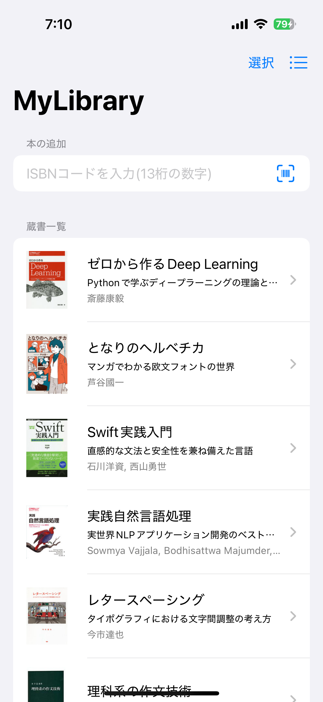</kbd>
    &nbsp;&nbsp;&nbsp;&nbsp;
    <kbd>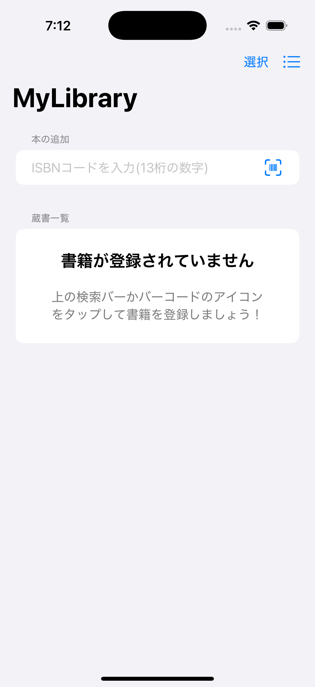</kbd>
  
 

### 本の詳細表示・編集画面

一覧画面で特定の本をタップすると詳細な情報が表示される．
右上の「編集」をタップすると保存されている情報を編集することができる．

  

    <kbd>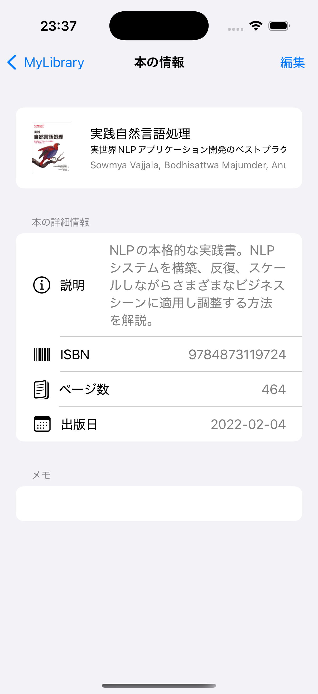</kbd>
    &nbsp;&nbsp;&nbsp;&nbsp;
    <kbd>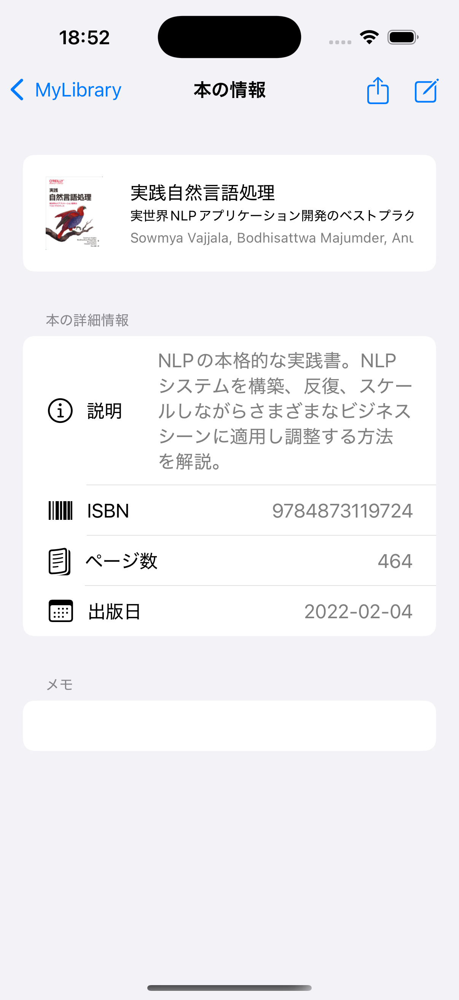</kbd>
  
 

また，本の情報とともにメモを残しておくことができる．
ここには本の感想や参考になった箇所など，ユーザの用途に応じて自由な内容を書き込むことができる．

### 本の追加 (ISBNコードを直接入力)

本の一覧画面ではISBNコードを直接入力して本の情報を追加できる．
ISBNコードを入力すると，Google Books APIで本の情報の取得が行われ，
その結果が入力された本の詳細画面が表示される．この画面で「登録」をタップすると
本の情報が保存される．なお，本の情報が見つからなかった場合はISBNコードが入力された状態になり，
その他の情報を手動で入力して追加することもできる．

  

    <kbd>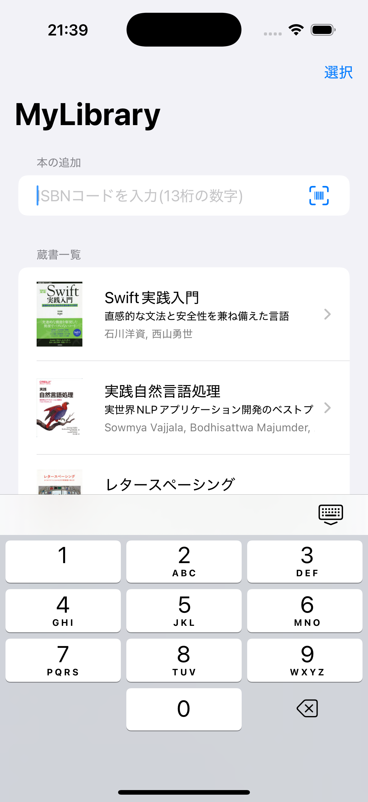</kbd>
    &nbsp;&nbsp;&nbsp;&nbsp;
    <kbd>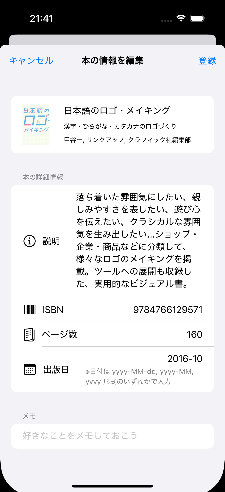</kbd> 
    &nbsp;&nbsp;&nbsp;&nbsp;
    <kbd>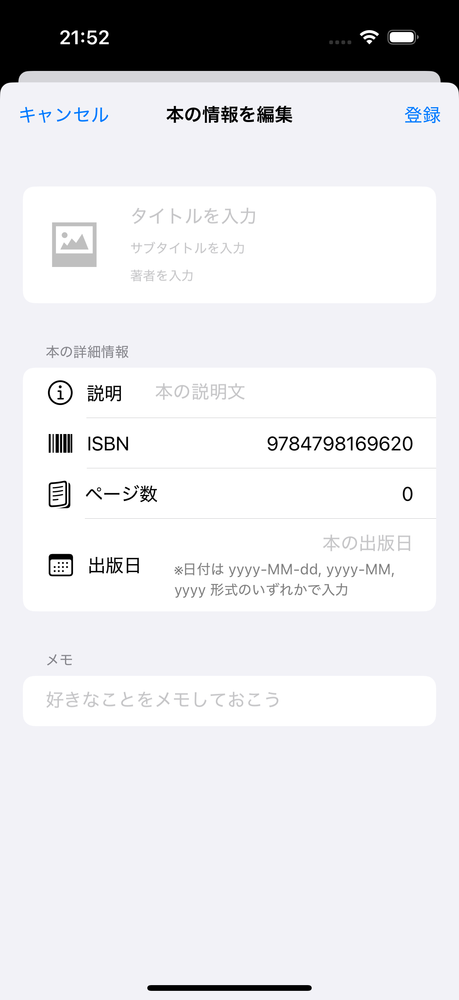</kbd>
  
 

### 本の追加 (バーコードスキャン)

本の一覧画面の入力フォームの横にあるアイコンをタップすると，
カメラが起動する．この画面で本の背表紙にあるISBNコードをスキャンすることで
本の情報を取得できる．
スキャン後の挙動については直接入力するときと同様である．

  

    <kbd>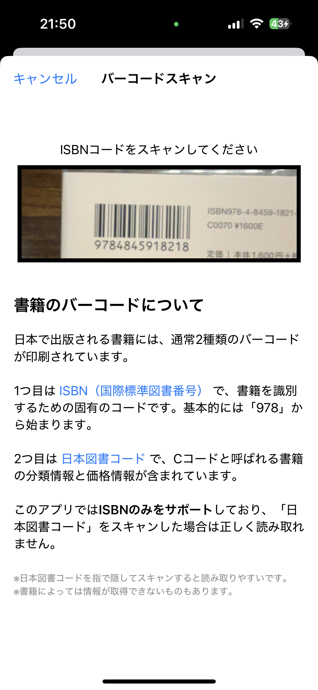</kbd>
    &nbsp;&nbsp;&nbsp;&nbsp;
    <kbd>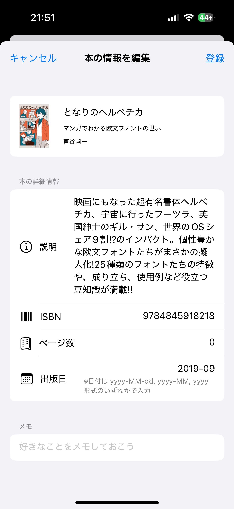</kbd>
  
 

### 本の削除

本の一覧画面の右上の「選択」をタップすると本を複数選択できる．
本を選択すると右下に「削除」ボタンが表示され，これをタップすると確認用のアラートが表示された後に
本を削除した一覧が表示される．

  

    <kbd>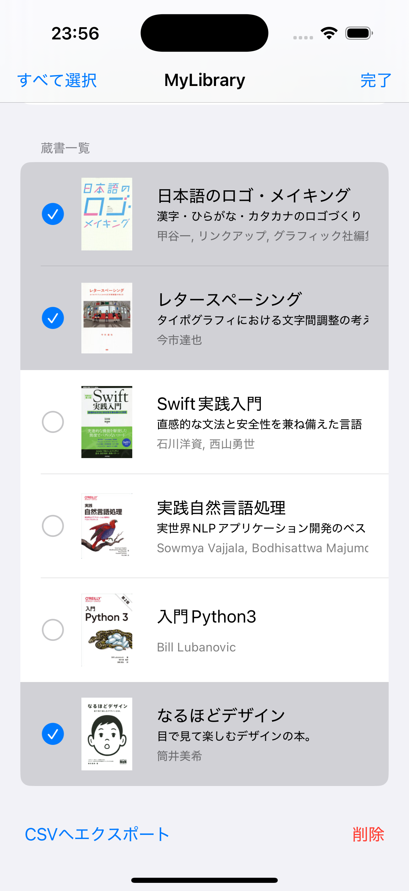</kbd>
    &nbsp;&nbsp;&nbsp;&nbsp;
    <kbd>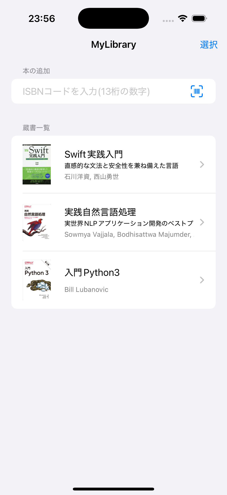</kbd>
  
 

## 工夫した点

### MVVMアーキテクチャの利用

Model・View・ViewModelに独立させて実装した．これにより，以下のメリットを得られた：

- UIロジックとデータ処理を分離することで，コードの見通しが良くなった
- コンポーネントの再利用が容易になり，新機能の追加や仕様変更にも対応しやすくなった

### 分かりやすいフォルダ構成

MVVMアーキテクチャを導入したので，フォルダ構成も`Models`・`Views`・`ViewModels`・`Utils`で分割して管理することで，
ファイルの位置を明確にして，開発時の可読性を向上させた．
さらに，`Views`内では多用できる部分を`Compornents`に分割して分かりやすくしている．

### コンポーネントの分割

このアプリでは本の基本情報(書影・タイトル・サブタイトル・著者)を`ListView`と`BookDetailView`
の両方で利用していたり，`BookDetailView`の詳細情報の各項目は
同じような記述の繰り返しとなっていたりする．
このような処理は別のViewとしてファイルを分割することで再利用性を高めるように工夫した．

### Git/GitHubの活用

個人開発で小規模なアプリであるため，ブランチ管理としてGitHub Flowを採用した．これにより，以下のメリットを得られた：

- `feature/XXX`のように機能ごとにブランチを分けることで，1つの機能に集中しやすくなった
- mainブランチは動作確認が完了したものだけをマージすることで安定した状態を維持できるようになった
- 開発の進捗管理がしやすくなった

また，開発中に気になったバグや追加するべきだと感じた機能についてissueを活用することで
課題を明確化し，機能改善をしやすくなるように意識した．

### ライト・ダークモード両対応

どちらの表示に設定していたとしても，問題なく画面表示が行えるように工夫した．

  

    <kbd>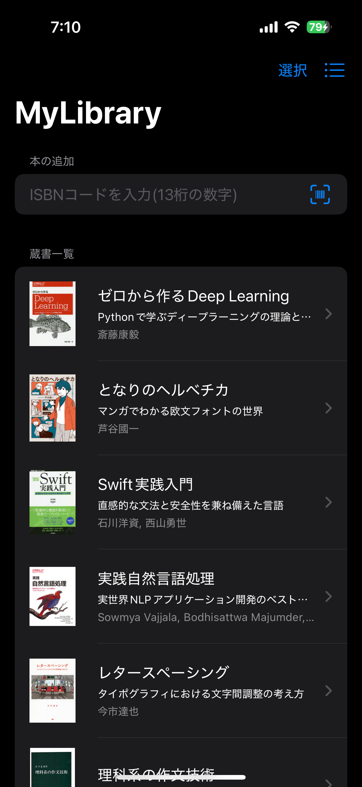</kbd>
    &nbsp;&nbsp;&nbsp;&nbsp;
    <kbd>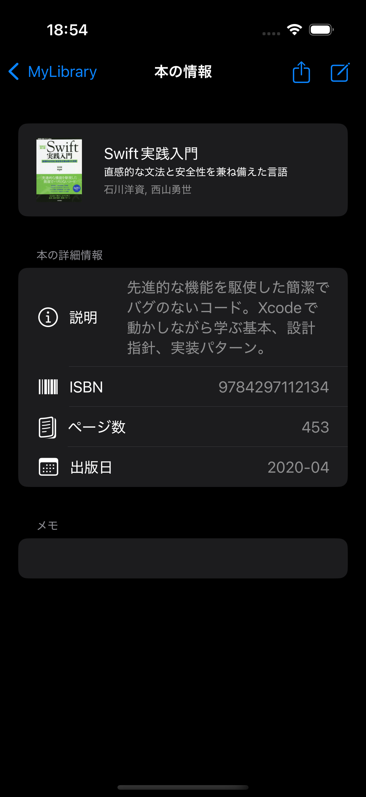</kbd>
  
 

### バーコードスキャンで登録可能

大量の本を持っているとき，全ての本のISBNコードをユーザが手入力して登録するのは大変な作業である．
そこで，カメラで背表紙についているバーコードをスキャンすることで**手軽に登録できるように**工夫した．
実は，このアプリを作ろうと思った理由の一つがバーコードスキャンで効率的に本の情報を取得したかったからである．

### 削除前に警告を表示

情報の削除は実行すると元に戻せない作業であるため，削除前に警告アラートを出現させることで誤操作を防ぐように工夫した．

  

    <kbd>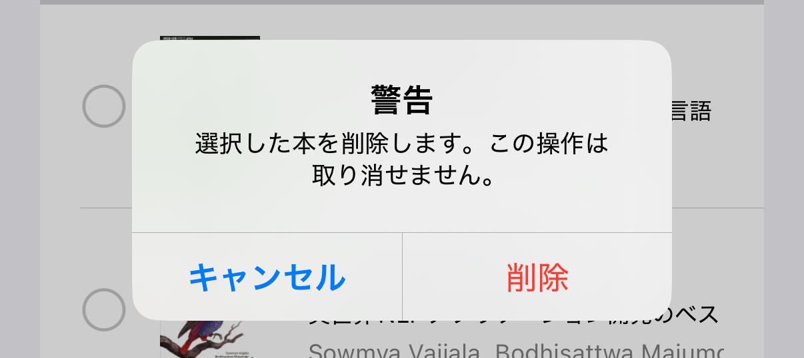</kbd>
  
 

### カメラの表示範囲を限定

1つの画面に複数のバーコードが存在する場合はいずれか1つが認識されるため動作が安定しない．
これを防ぐために，[バーコードスキャンの画面](#scanner)のカメラの表示範囲を1つのバーコードスキャンに適したサイズと比率にリサイズすることで，
**目的とは異なるバーコードがスキャンされる可能性を低める**ように工夫した．

### バーコードスキャンの方法を説明

本の背表紙には2種類のバーコードが印刷されている．
このアプリでは，2つのバーコードの意味を知らない人でも安心して使えるようにするために，
[バーコードスキャンの画面](#scanner)で2つのバーコードの説明文を記載し，**何をスキャンすればよいのかを初見でも分かるように**工夫した．

### キーパッドを利用

ISBNコードは13桁の数字であるので，入力用のキーボードも数字入力に適した[キーパッド](#keypad)を採用した．
これにより，数字の入力を簡単に行えるようにするともに，**数字以外の入力が行えなくなるように**工夫した．
また，このキーパッドにはsubmitボタンが無いため，13桁の数字が入力されたら自動で検索を実行するようにした．

### ISBNコードを入力する際の入力チェック

ISBNコードは現状，`978`から始まるものしか存在しない(枯渇したら`979`から始まるらしい)．
これを満たさないものはISBNコードではないためこれを利用してAPIを叩いても所望の本を取得できない．
そのため，ISBNコードでない入力が行われたときは警告文を表示するようにした．
また，すでに登録済みの本(ISBNコードが一致)が入力されたときに重複で登録できないようにするために
チェックを行い警告文を表示するようにした．

  

    <kbd>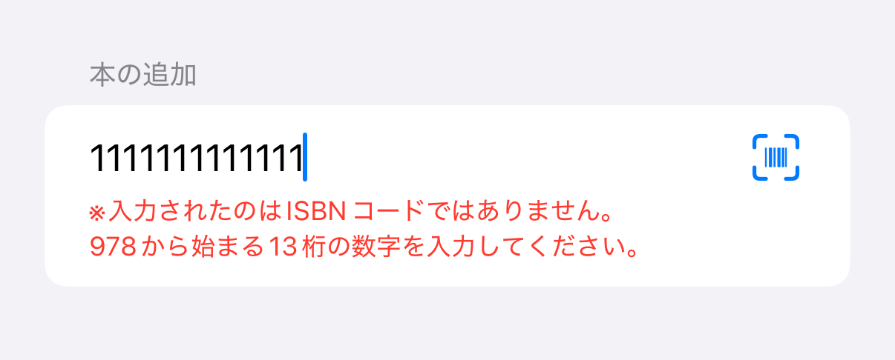</kbd>
    &nbsp;&nbsp;&nbsp;&nbsp;
    <kbd>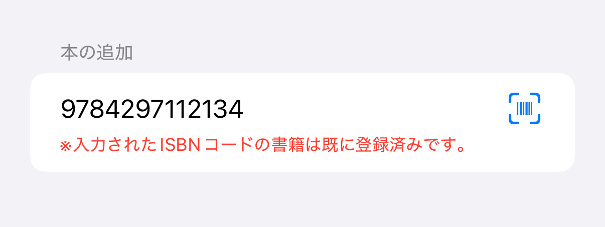</kbd>
  
 

なお，このチェックはバーコードスキャンを行ったときにも行われる．

### 本の情報をCSVファイルにエクスポート可能

登録した情報は，このアプリ以外の場所でも利用できるように
選択した本の情報をCSV形式に変換し，エクスポートできるようにしている．
これにより，蔵書一覧をPCなど他の環境でも利用したり，他の人にも共有したりすることができる．

  

    <kbd>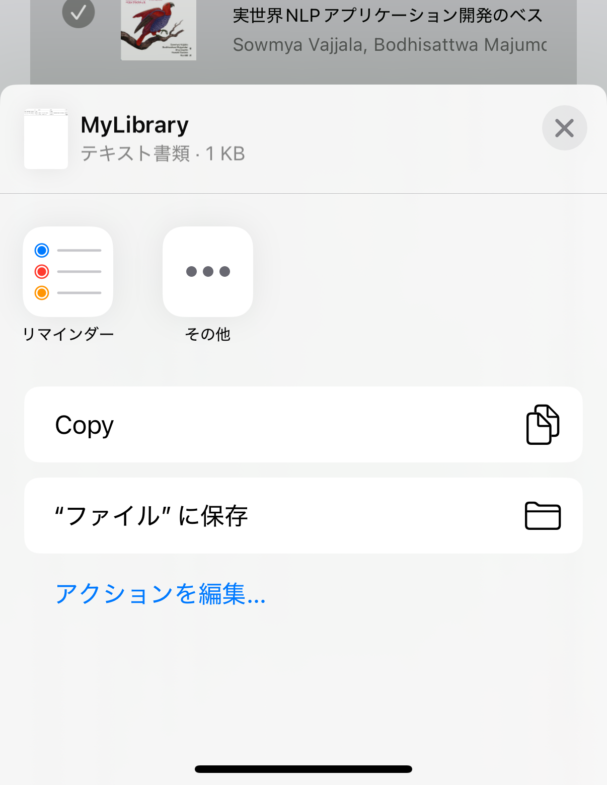</kbd>
  
 

[エクスポートされたCSVファイルのサンプル](https://github.com/atmhusky/MyLibrary/blob/main/MyLibrary.csv)

### 個別の本をテキストで共有可能

本の詳細表示画面でShareLinkをタップすると，本のタイトル・サブタイトル・著者・ISBNコードの情報を共有に適した形式でテキスト化し，X(Twitter)やLINEなどで共有できる．

  

    <kbd>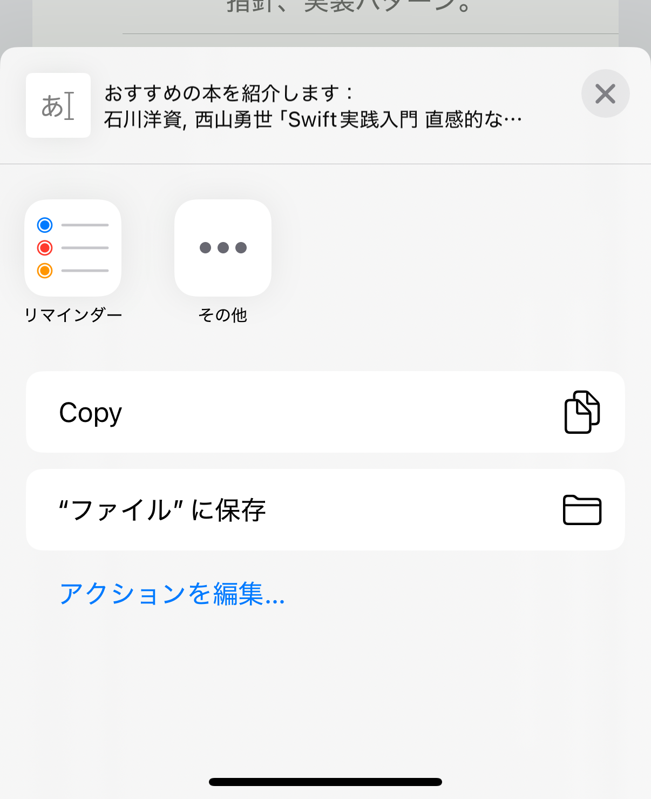</kbd>
  
 

## 今後の改善点

アプリをより良くしていくために，以下のような改善を続けていきたい：

- APIの変更
  - 現状，Google Books APIで取得できる情報のみを利用しているが，このAPIでは出版社や価格などの情報が取得できないので内容不足を感じる
  - ISBNコードを利用した検索がうまくできない本が多い
    - 内部の識別子としてISBNとは異なる専用のキーのみが保存されていることが原因
    - そもそもGoogle Booksに登録されていないことが原因
  - 登録不要で利用できるAPIでは取得できる情報に偏りや限度があるので，楽天ブックス系APIや国立国会図書館サーチのAPIなどの導入も検討したい
- 本の一覧のソート機能
  - 現在は追加順でソートしているが，五十音順や出版日順など，他のソートも自由に切り替えられるようにしたい
- ~~個別の本の共有機能~~
  - ~~個別の本を他の人に共有できる機能を追加したい~~
  - ~~本の情報を文章化してTweetをできる機能を追加したい (`#nowplaying`みたいな感覚で利用できるもの)~~ ← 実装済み
- アプリのリリース
  - 実際にリリース作業を経験し，他のユーザからのフィードバックをもらいたい